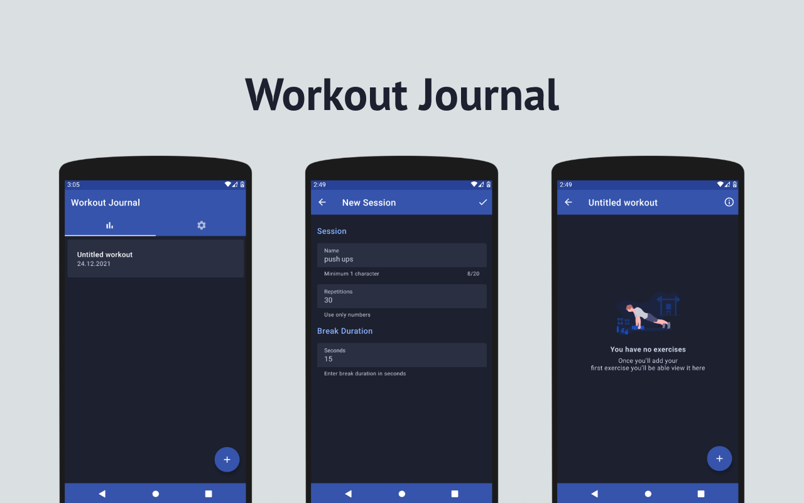
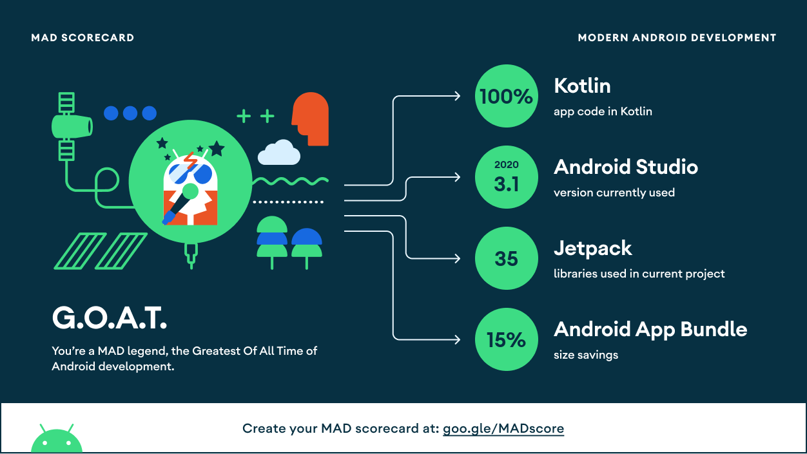

<h1 align="center">Workout-Journal</h1>

  
  
   
   

  
Workout Journal is the app for those who want to track their progress over a workout and a calendar period.

## Tech stack & Open-source libraries

### Language

- [Kotlin](https://kotlinlang.org)
- [Coroutines](https://kotlinlang.org/docs/coroutines-overview.html) & [Flow](https://kotlinlang.org/docs/flow.html) for asynchronous programming

### Android Software Development Kit 

- Target level 31
- Minimum level 23

### Open-source Libraries

- [Dagger Hilt](https://dagger.dev/hilt/) - a dependency injection library for Android
- [ViewBindingDelegate](https://github.com/kirich1409/ViewBindingPropertyDelegate) - a property delegate for [ViewBinding](https://developer.android.com/topic/libraries/view-binding)

### Jetpack Libraries

- [Room Persistence](https://developer.android.com/jetpack/androidx/releases/room) - an abstraction layer over SQLite
- [Navigation](https://developer.android.com/jetpack/androidx/releases/navigation) - a framework for navigating between 'destinations' 
- [Lifecycle](https://developer.android.com/jetpack/androidx/releases/lifecycle) - lifecycle-aware components
- [Recyclerview](https://developer.android.com/jetpack/androidx/releases/recyclerview) - a view group to create dynamic lists
- [Preferences](https://developer.android.com/jetpack/androidx/releases/preference) - interactive settings screens 

### Test Libraries

- [JUnit](https://junit.org/junit4/) - a simple framework to write repeatable tests
- [Espresso](https://developer.android.com/training/testing/espresso) - Android UI tests
- [MockK](https://mockk.io) - a mocking library for Kotlin

## MAD Score

## Download

## Suggestions

If you have general suggestions, please feel free to submit a new [Github issue](https://github.com/merklol/Workout-Journal/issues/new).

## License

Distributed under the MIT License. See [LICENSE](LICENSE.md) for more information.

## Contact

Maxim Smolyakov - [LinkedIn](https://linkedin.com/in/maxim-smolyakov-8945211a5) - [Email](mailto:sm.makism@icloud.com) - [Facebook](https://www.facebook.com/merk.merklol)